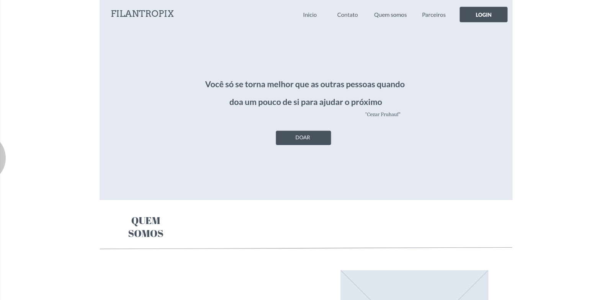
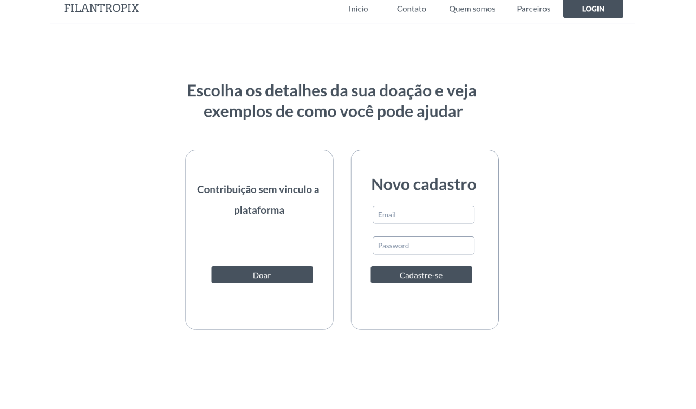
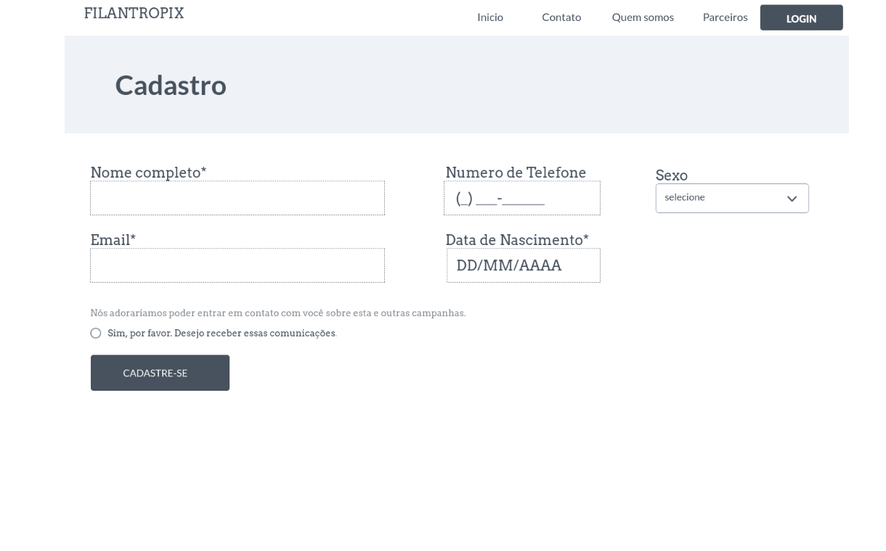
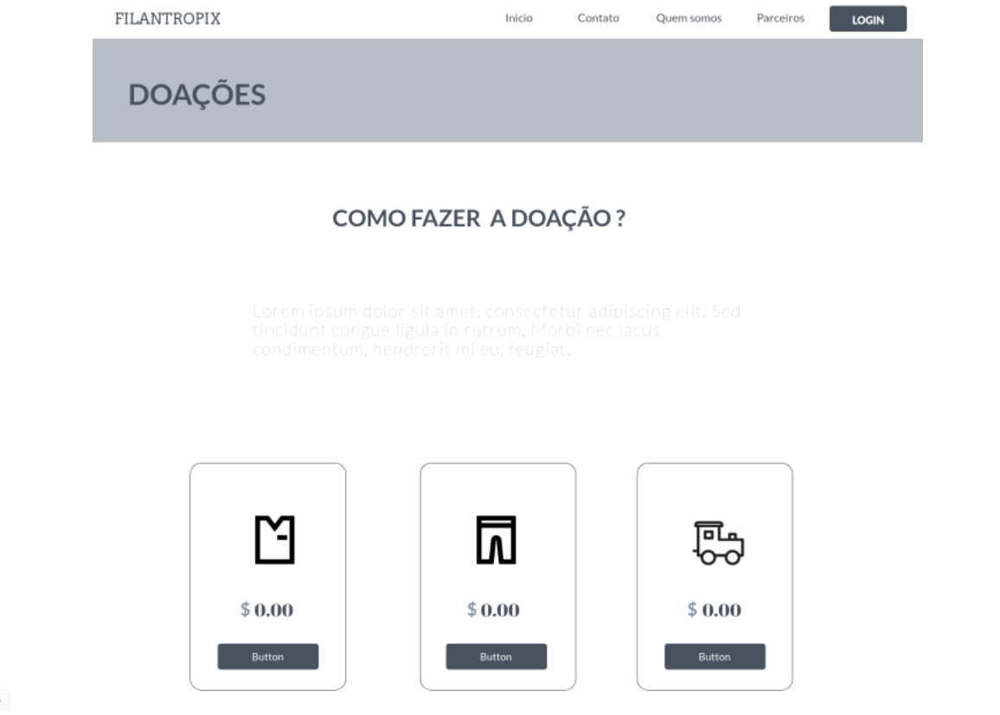
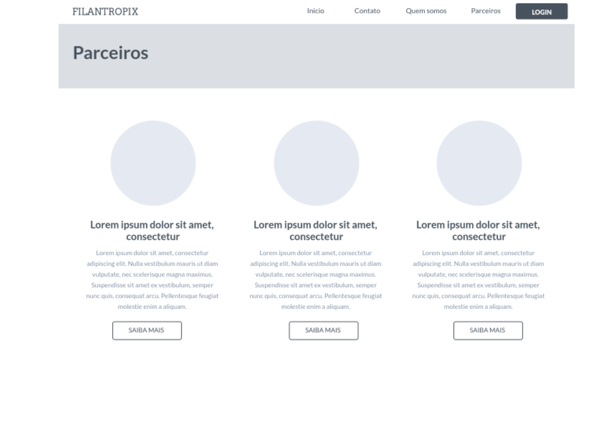
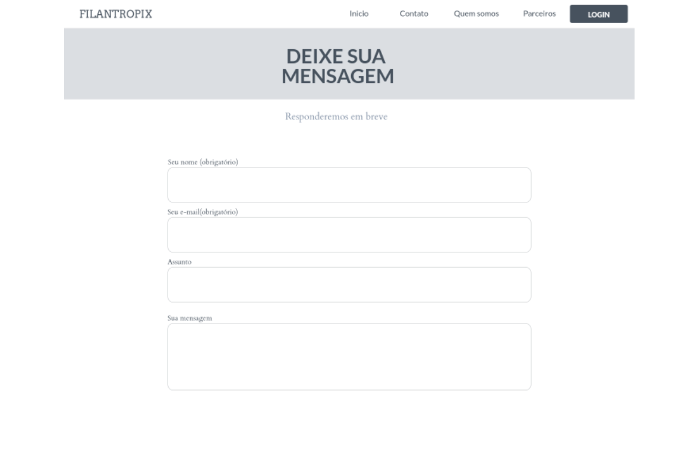

# Projeto de Interface

Dentre as preocupações para a montagem da interface do sistema, será 
estabelecido foco em questões como agilidade, acessibilidade e usabilidade. Desta 
forma, o projeto tem uma identidade visual padronizada em todas as telas que são 
projetadas para funcionamento em desktops e dispositivos móveis.

## User Flow

O diagrama apresentado na figura a seguir mostra o fluxo de interação do usuário 
pela navegação do sistema. Cada uma das telas deste fluxo é detalhada na seção de 
Wireframes que se segue. Para visualizar o Wireframe interativo, acesse: 

## Wireframes

#### Home Page

É a página de apresentação, onde falamos um pouco sobre quem somos  
e sobre as causas que apoiamos.

    

**Essa é uma amostra, para ver a tela completa acesse:** [Home-Page](https://marvelapp.com/prototype/7fjg35c/screen/86229812)

#### Contribution Selection Page

É a página onde o usuário seleciona se deseja fazer uma doação de modo rápido  
ou se cadastrar.

    

**Essa é uma amostra, para ver a tela completa acesse:** [Contribution-Selection-Page](https://marvelapp.com/prototype/7fjg35c/screen/86230423)

#### Cadatre Page

É a página onde o usuário se cadastra na plataforma.

    

**Essa é uma amostra, para ver a tela completa acesse:** [Cadastre-Page](https://marvelapp.com/prototype/7fjg35c/screen/86230736)

#### Contribution Page

É a página onde o usuário decide para quais itens a doação
será destinada.

    

**Essa é uma amostra, para ver a tela completa acesse:** [Contribution-Page](https://marvelapp.com/prototype/7fjg35c/screen/86249093)

#### Employees Page

É a página de colaboradores, onde é mostrado quais empresas  
apoiam e fazem parte da plataforma.

    

**Essa é uma amostra, para ver a tela completa acesse:** [Employees-Page](https://marvelapp.com/prototype/7fjg35c/screen/86249575)

#### Contacts Page

É a página onde os usuários e empresas podem nos contatar  
seja para suporte ou interesse em fazer da plataforma.

    

**Essa é uma amostra, para ver a tela completa acesse:** [Contacts-Page](https://marvelapp.com/prototype/7fjg35c/screen/86230999)
