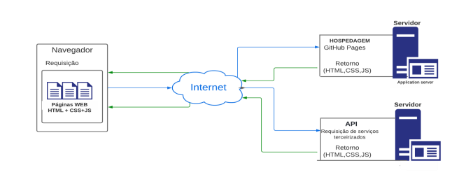

# Arquitetura da Solução

Nesse item do projeto demonstraremos os detalhes técnicos de implementação 
da solução do problema (Arquitetura da aplicação) a serem aplicadas pelo time de 
desenvolvedores demonstrando
os componentes e detalhes que compõe a parte do ambiente de hospedagem do 
projeto.

## Diagrama de componentes

Diagrama que permite a modelagem física de um sistema, através da visão dos seus componentes e relacionamentos entre os mesmos.

O diagrama a seguir mostra os detalhes técnicos aplicados pelos profissionais 
da equipe nesse cenário de hospedagem:

A solução implementada conta com os seguintes módulos:
- **Navegador** - Interface básica do sistema  
  - **Páginas Web** - Conjunto de arquivos HTML, CSS, JavaScript e imagens que implementam as funcionalidades do sistema.
  
 - **API** -  plataforma que permite o acesso a funções terceiros para serviços requisitados pelo usuário dentro da plataforma .  
 - **Hospedagem** - local na Internet onde as páginas são mantidas e acessadas pelo navegador. 

## Tecnologias Utilizadas

### Bootstrap:  
  É um framework de desenvolvimento web que será utilizado para facilitar  
  o processo de criação de páginas, visando agilidade.
  
  Veja a documentação, [aqui](https://getbootstrap.com/docs/5.2/getting-started/introduction/)

### Api do pagar.me:
  É uma api que auxilia o processo de pagamentos digitais,  
  que será usada para abstrair a parte de segurança referente aos pagamentos.
  
  Veja a documentação, [aqui](https://docs.pagar.me/)

## Hospedagem
   A hospedagem será feita através do [GitHub Pages](https://pages.github.com/),  
   sendo atualizado a cada nova release lançada.
   
